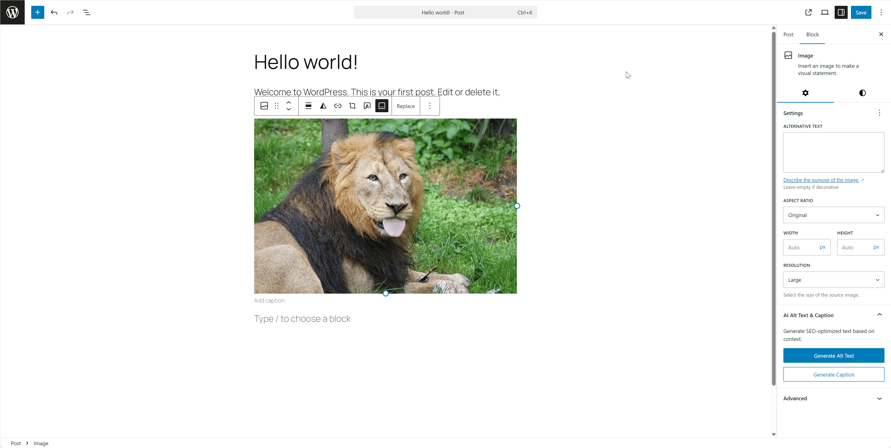

# Simple Alt Text Rewriter

**Simple Alt Text Rewriter** is a smart WordPress plugin that uses **Google Gemini AI** to generate SEO-optimized Alt Text and engaging Image Captions. 

Unlike other plugins that only "look" at the image, this plugin **reads the surrounding text (context)** to understand the image's role in your article. This ensures your Alt Text is not just descriptive, but also highly relevant for SEO and Accessibility.



## How It Works

1.  **Context Extraction**: When you click "Generate", the plugin scans the content surrounding the image (paragraphs, headings) in your post.
2.  **Vision Analysis**: It sends both the image data and the extracted context to Google Gemini AI.
3.  **Semantic Generation**: The AI analyzes the visual content *in relation* to your text. It doesn't just say "A cat sitting", but might say "A cat sitting on a laptop, illustrating the concept of remote work distractions", depending on your article's topic.
4.  **Integration**: The generated text is automatically inserted into the Alt Text or Caption field.

## Features

*   **Context-Aware**: Analyzes the text surrounding the image (Gutenberg blocks or Classic content) to insert relevant keywords naturally.
*   **Multimodal AI**: Uses Google Gemini Pro/Flash Vision to "see" the image and "read" the text simultaneously.
*   **W3C Compliant**: Generates Alt Text following strict web accessibility standards (no "image of...", concise, functional).
*   **SEO Boost**: Helps you rank better in Google Images by creating semantic connections between your content and media.
*   **Two Modes**:
    *   **Alt Text**: Short, dry, descriptive (max 125 chars).
    *   **Captions/Descriptions**: Engaging, longer text for users.
*   **Proxy Support**: Built-in support for custom API Base URL to bypass regional restrictions (e.g., for EU/RU users).

## Requirements

*   WordPress 5.8 or higher
*   PHP 7.4 or higher
*   Google Gemini API Key (Free tier available)

## Installation

1.  Download the latest `.zip` release from the [Releases page](../../releases).
2.  Go to your WordPress Admin -> **Plugins** -> **Add New** -> **Upload Plugin**.
3.  Upload the zip file and click **Activate**.

## Configuration

1.  Go to **Settings** -> **Alt Text Rewriter**.
2.  Paste your **Google Gemini API Key** (Get it [here](https://aistudio.google.com/app/apikey)).
3.  (Optional) **Custom Prompts**: You can modify the system prompts used for Alt Text or Descriptions to fit your tone of voice.
4.  (Optional) **API Base URL**: If you are in a region where Gemini API is blocked (e.g., Europe, Russia), change the Base URL to your proxy (e.g., Cloudflare Worker).

## Usage

### In Gutenberg (Block Editor)
1.  Select an **Image Block**.
2.  Look at the Sidebar (Inspector) on the right.
3.  Find the **"AI Alt Text & Caption"** panel.
4.  Click **Generate Alt Text** or **Generate Caption**.
5.  Wait a second, and the text will automatically fill the fields!

### In Media Library
1.  Go to **Media** -> **Library**.
2.  Click on any image to open the details modal.
3.  You will see **"Generate Alt with AI"** and **"Generate Description with AI"** buttons next to the respective fields.
4.  Click to generate and automatically save.

## Troubleshooting

**Error: "User location is not supported"**
Google blocks requests from certain IP addresses. To fix this:
1.  Create a Cloudflare Worker (Free) with the following code:
    ```javascript
    export default {
      async fetch(request) {
        const url = new URL(request.url);
        url.hostname = 'generativelanguage.googleapis.com';
        const newRequest = new Request(url.toString(), {
          method: request.method,
          headers: request.headers,
          body: request.body
        });
        return fetch(newRequest);
      },
    };
    ```
2.  Copy your worker URL (e.g., `https://my-proxy.worker.dev`).
3.  Paste it into **Settings** -> **Alt Text Rewriter** -> **API Base URL**.

## License

GPLv2 or later.
